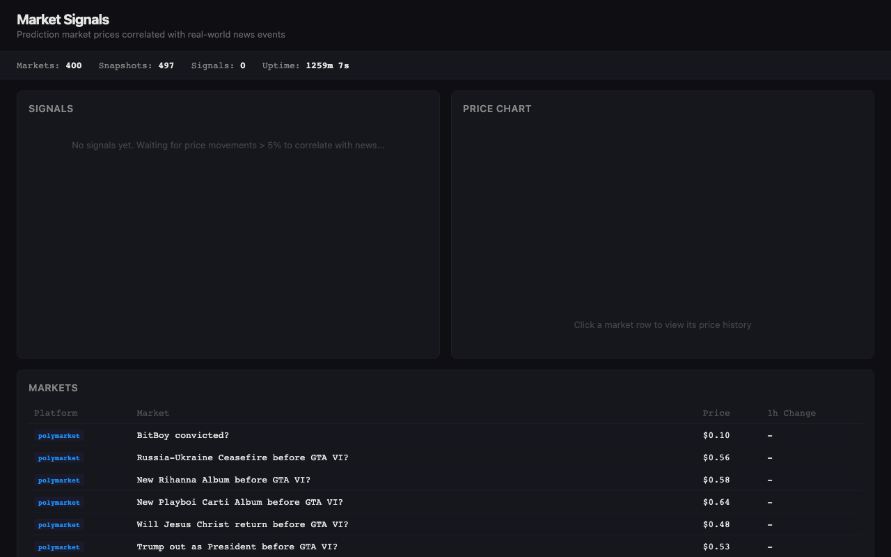

# Market Signals

Real-time dashboard that polls prediction market contracts from Kalshi and Polymarket, correlates price movements with timestamped news events from GDELT, and highlights which news actually moved markets vs. noise.

## Demo

[Live demo] | 

## The Problem

Prediction markets move when real-world events happen, but there's no tool that shows you the connection. You see a contract price jump 10% and wonder: what caused it? Was it news, a whale trade, or organic sentiment? Existing dashboards show prices or news separately. Nothing correlates them in real time across platforms.

## How It Works

**Polling loop** (every 60 seconds):
1. Fetch 100 markets each from Kalshi and Polymarket public APIs
2. Store price snapshots in SQLite
3. Detect price changes > 5% in the last hour
4. For each changed market, fetch relevant news from GDELT (keyword matching from market titles)
5. Score news-market correlations: `keyword_overlap_ratio * time_proximity_factor`
6. Surface high-confidence signals on the dashboard

**Dashboard** (auto-refreshes every 30s):
- Signal feed: market + news pairs ranked by correlation score and price impact
- Price chart: select any market, see price over time with news event markers
- Market browser: all tracked markets sorted by price change

## Tech Stack

- **Backend:** Python 3.12, aiohttp (concurrent API polling), aiosqlite (zero-config persistence), FastAPI
- **Frontend:** Static HTML + Chart.js + vanilla JS (no build step)
- **Data sources:** Kalshi API, Polymarket Gamma API, GDELT (all free, no auth required)
- **Why this stack:** Data pipelines are Python's sweet spot. aiohttp for non-blocking concurrent polling. SQLite because we're building our own time series (Polymarket's history API is broken). Static frontend avoids build complexity while producing interactive charts.

## The Hard Part

News-to-market correlation without drowning in false positives. Markets move for many reasons, and keyword matching is noisy. The scoring function uses two factors: **keyword overlap ratio** (how many of the market's title words appear in the article) times **time proximity decay** (exponential falloff from the price change timestamp, zero at 2 hours). This is simple but effective because prediction market titles are topical by nature -- they contain the exact keywords that news articles use.

## Getting Started

```bash
pip install -e .
python -m market_signals
```

Open http://localhost:8080. The poller starts immediately, dashboard auto-refreshes.

```bash
# Or with Docker
docker build -t market-signals .
docker run -p 8080:8080 market-signals
```

## API

```
GET /api/markets          # All tracked markets with 1h/24h price changes
GET /api/markets/{id}/history?hours=24  # Price series + correlated news events
GET /api/signals?limit=20&min_change=5  # Signal feed, ranked by recency
GET /api/news?limit=20    # Recent news articles
GET /api/stats            # Markets tracked, snapshots, signals, uptime
```

## License

MIT
